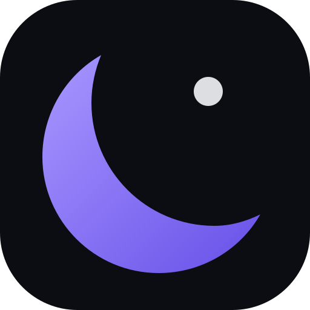
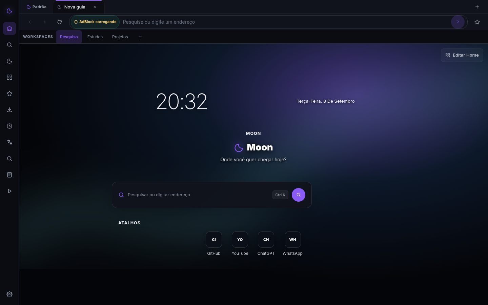
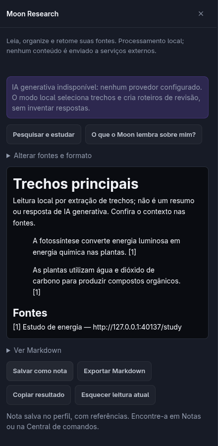
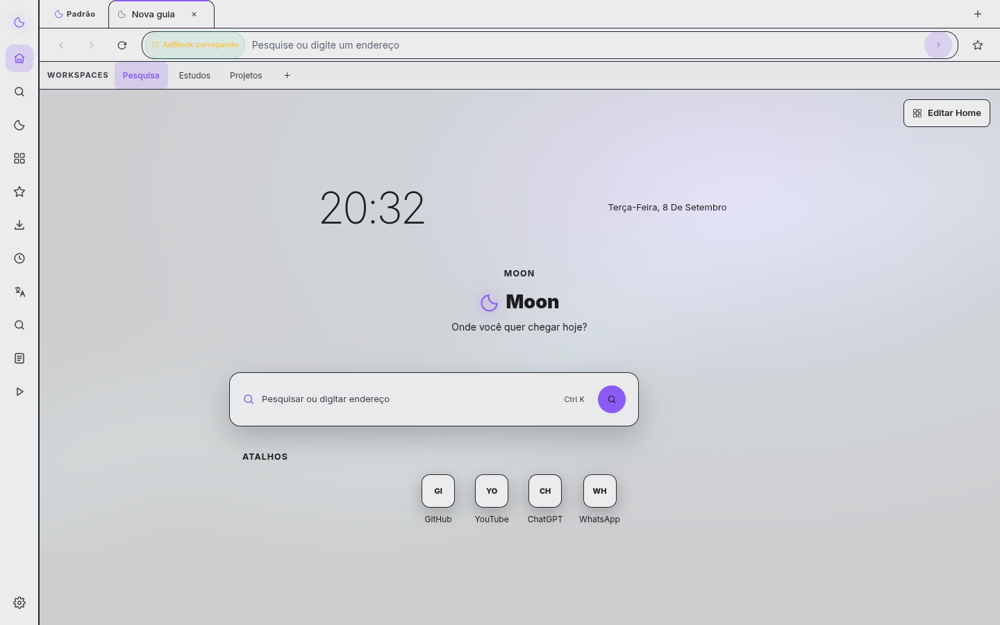
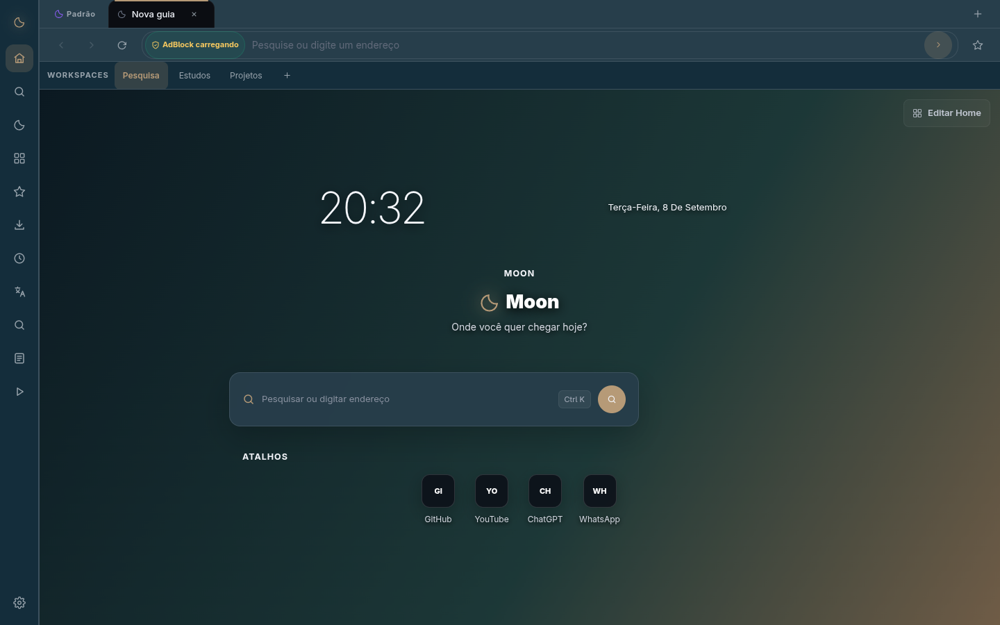
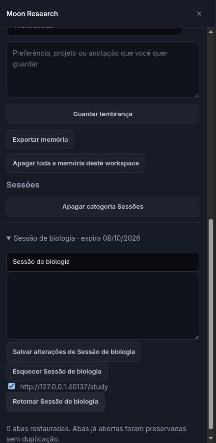
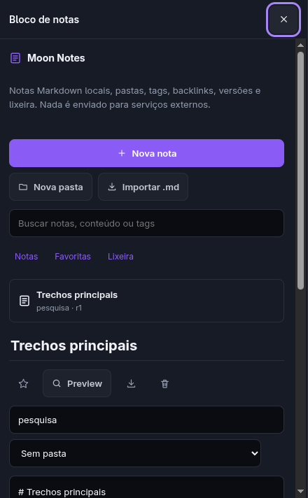

<div align="center">
  

# Moon Browser

**Organize suas fontes, guarde suas notas e retome suas páginas.**

Navegador desktop open source da Nexus Inc. para reunir navegação, estudo e personalização no mesmo lugar.
Pesquisa por trechos e memória manual, com armazenamento local e escolha explícita do que guardar.

[](https://github.com/heitgh/Moon-browser/actions/workflows/quality.yml)

**Alpha experimental · código: `0.6.0-alpha.1` · download público: `v0.5.0-demo.2`**

[Experimentar](#instalacao) · [Documentação](#documentacao) · [Reportar bug](https://github.com/heitgh/Moon-browser/issues) · [Licença MIT](LICENSE)

</div>



*Captura real da alpha, com perfil de teste. O indicador registra o AdBlock ainda carregando naquele instante.*

> **Estado do projeto:** o fluxo Research/Memory apresentado aqui está no código da `main`, mas ainda não tem release pública. A demo para download é anterior e não inclui esse fluxo. O Moon permanece experimental: não o use como único navegador para dados críticos. IA generativa, extração de PDF e sincronização remota estão indisponíveis.

[Por que usar](#por-que) · [Fluxo de estudo](#fluxo) · [Recursos e limites](#recursos) · [Comparação](#comparacao) · [Privacidade](#privacidade) · [Desenvolvimento](#desenvolvimento)

<a id="por-que"></a>
## Por que usar o Moon?

- **Retome um assunto.** Separe páginas em workspaces e salve uma sessão nomeada para reabrir as URLs escolhidas. A retomada experimental evita duplicar URLs já abertas nesse workspace.
- **Guarde o trecho junto da fonte.** O Research extrai passagens de abas selecionadas e permite salvar uma nota com referências ou exportar Markdown. Você confere o contexto na página original.
- **Decida o que será lembrado.** A memória começa desligada em todas as categorias. Cada gravação é manual, por workspace, com edição, expiração, exportação e exclusão.
- **Adapte o espaço de trabalho.** Mude a composição da Home, a posição das abas, temas, ícones e wallpapers. A Personalização oferece prévia, aplicar/cancelar e reversão.
- **Encontre o trabalho salvo.** A Central de comandos reúne abas, favoritos, histórico, notas, downloads, workspaces e configurações; Foco/Zen oferece sessões temporizadas e Pomodoro.

O recorte é útil para experimentar organização de leituras e projetos. O benefício para estudantes, pesquisadores e profissionais com muitas páginas é uma **hipótese de produto**; ainda não há estudo com novos usuários que comprove tempo economizado ou retenção. A primeira nota com referências é o ponto inicial para avaliar valor, sem promessa de duração.

<a id="fluxo"></a>
## Da leitura à retomada

Este fluxo requer a **alpha executada a partir do código**. Use uma página HTML com conteúdo não sensível.

| Passo | O que fazer | O que fica disponível |
| --- | --- | --- |
| 1. Abrir | Abra as páginas no mesmo workspace e entre em **Moon Research** pela barra lateral. | Fontes elegíveis para seleção. |
| 2. Escolher | Selecione de uma a cinco abas e marque a autorização de leitura local. | Leitura somente das abas escolhidas. |
| 3. Conferir | Escolha **Trechos principais**, **Comparar fontes**, cartões ou roteiro de estudo; clique em **Ler fontes selecionadas**. | Passagens com título, URL e referência da fonte. |
| 4. Guardar | Use **Salvar como nota** ou **Exportar Markdown**. | Material consultável fora do painel de pesquisa. |
| 5. Salvar a sessão | Em **O que o Moon lembra sobre mim?**, habilite **Sessões**, dê um nome, escolha essa categoria e clique em **Guardar lembrança**. | Lista de até 50 URLs elegíveis do workspace. |
| 6. Voltar | Na lembrança, selecione as páginas e use **Retomar**. Encontre a nota pela Central de comandos. | Páginas reabertas e nota preservada no perfil. |

**O Research atual não é IA generativa.** “Buscar trechos por pergunta” procura palavras; a comparação reúne trechos iniciais; os cartões usam passagens como resposta de referência. Não há compreensão semântica, checagem da verdade das fontes ou quiz adaptativo. A captura aceita HTML/texto simples, com limite de 60 mil caracteres por fonte; PDFs não são extraídos.

<p align="center">
  
</p>

*Recorte do painel real. O endereço de loopback é uma fonte fictícia do teste E2E, não um serviço público.*

<a id="recursos"></a>
## Funcionalidades e maturidade

**Disponível** significa conectado ao desktop desta alpha, com implementação e testes no escopo indicado; não significa estabilidade ou homologação integral. **Fundação técnica** significa contratos ou motores que ainda não entregam um serviço ao usuário.

| Estado | Área | Escopo e limite |
| --- | --- | --- |
| Disponível | Navegação, abas e janelas | HTTP/HTTPS, voltar/avançar, recarregar, abas horizontais/verticais; compatibilidade geral de sites e mídia ainda parcial. |
| Disponível | Workspaces, favoritos e histórico | Organização local e persistência. Importação limitada a favoritos/histórico de fontes suportadas e favoritos HTML. |
| Disponível | Perfis, convidado e janela privada | Perfis separados; convidado temporário; abas privadas não restauradas. Veja os limites de isolamento abaixo. |
| Disponível | Sessão após reinício | Restauração de abas não privadas; não é recuperação completa do estado interno dos sites. |
| Disponível | Home e Personalização V4 | Widgets, presets, layout, temas locais e `.moontheme`, ícones, wallpapers estáticos e GIF/WebP animados. Vídeo como wallpaper indisponível. |
| Disponível | Notas | Markdown, pastas, tags, vínculos, versões, lixeira e importação/exportação; cobertura de todos os controles ainda parcial. |
| Disponível | Central de comandos e Foco/Zen | Busca local nas fontes conectadas, timer/Pomodoro, pausa e resumo local. Sem busca semântica ou omnibox universal. |
| Disponível | Downloads, permissões e AdBlock | Downloads Electron, permissões revogáveis por origem e bloqueio Ghostery; falhas de rede, mídia e arquivos perigosos exigem mais homologação. |
| Experimental | Moon Research | Extração local, trechos referenciados, comparação inicial e material de revisão; sem provedor de IA. |
| Experimental | Moon Memory e sessões nomeadas | Memória manual por categoria/workspace; retomada de URLs. Sem grupos, posição de leitura ou estado de mídia. |
| Fundação técnica; produção bloqueada | Sync e cofre | Motores/fixtures E2EE e contratos de credenciais. Sem provider oficial, cofre persistente ou autofill operacional. |
| Fundação técnica; desativada | Extensões e plugins | Não há instalação liberada nem compatibilidade ampla com a Chrome Web Store. |
| Planejado / indisponível | IA generativa, PDF, Moon Hub, Nexus School, VPN e mobile | Flags, contratos ou planejamento não equivalem a produtos publicados. |
| Indisponível | Atualizador automático e assinatura de distribuição | Atualização manual; assinatura e homologação de recuperação ainda pendentes. |

Provas e detalhes: [matriz de validação da alpha](docs/update/RELATORIO.md#6-matriz-de-testes), [Research/Memory](docs/update/ARQUITETURA.md), [Personalização V4](docs/audits/personalization-studio-v4-final-2026-08-30.md), [flags](config/feature-flags.ts), [sync/cofre](docs/architecture/sync-e2ee-threat-model.md) e [extensões](docs/adr/0006-extensions.md). As auditorias de agosto documentam a base anterior; seus resultados não são testes novos da alpha.

<a id="comparacao"></a>
## Como o Moon se compara

**Consulta: 10 e 11 de setembro de 2026, horário de Brasília.** Comparação documental do desktop, usando fontes oficiais consultadas nessas datas e o código do Moon em [`654adae`](https://github.com/heitgh/Moon-browser/tree/654adaefcf1de2cb76bef6cac3436b253e2705ef). Não é benchmark, auditoria de segurança ou teste de todas as versões. Disponibilidade pode variar por sistema, país, conta e plano.

| Navegador | Organizar e retomar contexto | Pesquisa, estudo e personalização |
| --- | --- | --- |
| **Moon** | Workspaces e notas locais; memória manual e sessões por URL experimentais. | Extração com fontes; Home, layout, ícones e temas editáveis. IA e PDF indisponíveis. |
| **Chrome** | [Perfis](https://support.google.com/chrome/answer/2364824?hl=en-GB) e [grupos de abas salvos/sincronizados](https://support.google.com/chrome/answer/2391819?hl=en&co=GENIE.Platform%3DDesktop). | [Gemini no Chrome](https://www.google.com/chrome/ai-innovations/) oferece ajuda sobre páginas e abas, conforme disponibilidade. Perfis permitem nome, imagem e cores. |
| **Edge** | [Workspaces](https://www.microsoft.com/en-us/edge/features/workspaces) salvam abas/favoritos; a experiência nova exige conta e não oferece colaboração. | [Copilot](https://support.microsoft.com/en-us/microsoft-copilot/getting-started-with-copilot-in-microsoft-edge) trabalha com páginas e PDFs; [sleeping tabs](https://www.microsoft.com/en-us/edge/features/sleeping-tabs) suspendem abas inativas. |
| **Opera** | [Workspaces, Tab Islands e barra lateral](https://help.opera.com/en/latest/features/) organizam navegação e ferramentas. | Split Screen, AdBlock e VPN do navegador documentados; [Opera AI](https://blogs.opera.com/news/2025/12/opera-ai-comes-to-opera-one-opera-gx-opera-air/) oferece assistência integrada. |
| **Arc** | [Spaces e Profiles](https://resources.arc.net/hc/en-us/articles/19227964556183-Profiles-Separate-Work-Personal-Browsing) separam contextos e dados. | [Split View](https://resources.arc.net/hc/en-us/articles/19335393146775-Split-View-View-Multiple-Tabs-at-Once) e temas. A [página atual](https://arc.net/) informa manutenção limitada a atualizações do Chromium; desktop para Windows/macOS. |
| **Vivaldi** | [Workspaces](https://help.vivaldi.com/desktop/tabs/workspaces/), Tab Stacks e [sessões editáveis](https://help.vivaldi.com/desktop/panels/sessions-panel/). | [Notas com Markdown e exportação](https://help.vivaldi.com/desktop/tools/notes-manager/), painéis, mosaicos e [personalização](https://vivaldi.com/features/). |

O Moon ainda fica atrás de alternativas estabelecidas em áreas concretas: o Chrome possui ecossistema de extensões e controles de segurança distribuídos; o Edge oferece PDF/IA e suspensão de abas; o Opera já integra serviços que o Moon apenas planeja; Arc tem Split View; Vivaldi tem agrupamento e sessões mais completas. Esses recursos não demonstram superioridade universal de nenhum navegador.

**Dados e custo de troca também contam:**

| Navegador | Controle de dados e ecossistema no recorte consultado |
| --- | --- |
| **Moon** | Research local; memória opt-in, editável e apagável, sem criptografia própria. Sem conta/sync remoto ou extensões liberadas. Importação reduzida; backup integral e rollback manual. |
| **Chrome** | Perfis locais e dados de conta entre dispositivos. [Controles de privacidade e Safe Browsing](https://www.google.com/chrome/safety/); a proteção aprimorada envia dados de navegação ao Google. |
| **Edge** | Workspaces sincronizados por conta. Copilot pode usar página, abas e histórico; [controles de contexto e consentimento](https://support.microsoft.com/en-us/microsoft-copilot/getting-started-with-copilot-in-microsoft-edge) variam por região e configuração. |
| **Opera** | A [documentação](https://help.opera.com/en/latest/features/) distingue recursos locais e serviços como VPN; a [IA](https://blogs.opera.com/news/2025/12/opera-ai-comes-to-opera-one-opera-gx-opera-air/) permite escolher contexto. Não pressupor processamento inteiramente local. |
| **Arc** | Perfis separam logins, histórico e extensões, mas [Profiles não sincronizam entre dispositivos](https://resources.arc.net/hc/en-us/articles/19227964556183-Profiles-Separate-Work-Personal-Browsing). Verificar o escopo do sync antes de migrar. |
| **Vivaldi** | [Sync opt-in com criptografia ponta a ponta](https://help.vivaldi.com/desktop/tools/sync/) cobre categorias selecionadas, incluindo notas sem anexos; usa conta e servidores. A senha de criptografia exige cuidado na recuperação. |

“Memória” no Moon é uma coleção gravada manualmente, não um perfil inferido por IA. Não equiparamos isso a histórico, sync ou personalização de um assistente. Recursos e políticas mudam; consulte as fontes antes de migrar. Não há evidência de que o Moon seja mais rápido ou mais privado que os concorrentes.

<a id="galeria"></a>
## O produto em imagens

Capturas versionadas da alpha executada em 8 de setembro de 2026, com dados fictícios. Mostram os cenários capturados, não compatibilidade geral. Abra a imagem para inspecionar em tamanho original.

<details>
<summary>Home clara e personalização por wallpaper</summary>





A segunda captura demonstra o resultado visual da paleta aplicada; não é uma captura do editor de temas. Ambas registram o bloqueador ainda carregando.

</details>

<details>
<summary>Sessão nomeada e nota criada a partir da pesquisa</summary>

<p align="center">
  
</p>

A sessão guarda URLs escolhidas para retomada. O recorte não mostra os controles de consentimento no início do painel.

<p align="center">
  
</p>

A nota vem do fluxo E2E do Research; o recorte mostra o editor, sem exibir o documento completo.

</details>

Origem: [script de galeria](scripts/development/capture-update-gallery.ts) e [teste E2E](tests/e2e/desktop-smoke.spec.ts). [Créditos dos assets](#licenca).

<a id="documentacao"></a>
## Arquitetura em visão rápida

O Moon usa Electron/Chromium para exibir páginas, TypeScript para a aplicação e SQLite como fonte canônica dos dados locais. A interface pede operações por uma ponte explícita; o processo principal valida as solicitações e acessa os serviços e o banco.

```text
Interface local
  → preload com operações permitidas
  → IPC validado no processo principal
  → serviços da aplicação
      ├─ SQLite do perfil
      └─ páginas em WebContentsView isolado
```

As páginas remotas não recebem Node.js nem o preload do Moon. A UI local usa sandbox e isolamento de contexto. Perfis têm bancos e partições separados; **neste runtime, cada workspace também tem sua própria partição Chromium**, podendo exigir login separado no mesmo site. A separação conceitual entre workspace e container no ADR 0004 é uma direção de evolução, não o comportamento já entregue.

Electron não equivale ao Chrome completo: compatibilidade de extensões e serviços de proteção precisa ser implementada e testada pelo aplicativo. O ciclo de atualização do runtime é parte da segurança. Veja a [orientação oficial do Electron](https://www.electronjs.org/docs/latest/tutorial/security) e seu [suporte a extensões](https://www.electronjs.org/docs/latest/api/extensions-api).

| Para aprofundar | Fonte |
| --- | --- |
| Fluxo e limites atuais de Research/Memory | [Arquitetura da alpha](docs/update/ARQUITETURA.md) |
| Organização das camadas | [Visão geral](docs/architecture/overview.md) e [decisões arquiteturais](docs/adr/) |
| Dados, backup e migração | [Storage](docs/architecture/storage.md) e [procedimento de recuperação](docs/update/MIGRACAO.md#rollback-exato) |
| Validação e limitações conhecidas | [Relatório da alpha](docs/update/RELATORIO.md) |
| Histórico do produto | [Changelog](CHANGELOG.md), [release 0.5](docs/releases/v0.5.0-demo.2.md) e [auditorias](docs/audits/) |

Documentos anteriores podem conter contratos futuros e estados históricos. Para disponibilidade atual, use a tabela deste README e o código correspondente.

<a id="privacidade"></a>
## Privacidade e segurança

### O que fica no computador

Preferências, workspaces, favoritos, histórico, notas, memória e sessões ficam no SQLite do perfil. O perfil padrão usa `profile/moon.sqlite3` dentro do diretório de dados do aplicativo (`userData`); outros perfis usam subdiretórios de `profiles`. Cookies e cache pertencem às partições Chromium. A personalização usa SQLite como autoridade; `localStorage` permanece como espelho/recuperação de dados legados.

**A memória não tem criptografia própria em repouso.** A proteção contra acesso local depende do sistema operacional. Guarde somente material não sensível e proteja também os arquivos exportados e backups.

### Quando uma página é lida

Research exige seleção de abas e autorização antes da captura. O processo principal confere janela, workspace, consentimento e limites. O extrator ignora formulários, campos editáveis, scripts e elementos ocultos; recusa páginas com senha, marcação de sensibilidade ou URLs potencialmente sensíveis. **Essas heurísticas não detectam todo dado sensível.**

O conteúdo capturado é tratado como texto não confiável; instruções encontradas numa página não são executadas. Não há provedor externo ou modelo generativo conectado ao Research. O resultado fica temporariamente no painel até salvar/exportar; **Esquecer leitura atual** o descarta. Cancelar descarta o resultado, mas a leitura nativa já iniciada pode continuar até o timeout.

Telemetria está desativada na configuração e não foi encontrada integração ativa no código inspecionado. Isso não significa ausência de tráfego: sites, buscador, listas do AdBlock, favicons e wallpapers remotos escolhidos podem gerar requisições. Sincronização remota permanece desativada.

### Como controlar a memória

As categorias **preferências, projetos, páginas, notas e sessões** começam desligadas. Habilitar uma categoria não captura dados automaticamente: é preciso guardar cada lembrança. Você pode editar, exportar Markdown, esquecer um item, apagar uma categoria ou apagar toda a memória do workspace.

Novas lembranças expiram em **7, 30 ou 90 dias**; a limpeza é aplicada ao carregar a memória. Há limite de 100 itens por workspace e limite de tamanho do documento. Desligar uma categoria impede novas gravações e alterações; os itens existentes continuam disponíveis para consulta e exclusão.

**Apagar memória remove registros ativos, não as notas salvas separadamente, exportações ou backups.** Também não garante apagamento forense do SQLite, WAL ou disco. Uma sessão nomeada guarda URLs, não grupos, rolagem, formulários ou o estado de sites; notas permanecem separadas no perfil.

### Perfis e janelas privadas

Perfis locais isolam dados e partições. O convidado usa diretório temporário e partições não persistentes, removidos no fechamento normal. Janelas privadas usam partições efêmeras, não restauram suas abas e não acessam Research/Memory. Esses controles não tornam a navegação anônima para sites ou provedores de rede; arquivos baixados continuam no sistema.

Sandbox, validação IPC, permissões e testes são mecanismos de defesa, não garantia absoluta. **Assinatura de distribuição, atualizador assinado, auditoria independente completa e homologação ampla ainda não foram comprovados.** Há cenários pendentes de acessibilidade, mídia, rede adversa e muitas abas. Consulte o [threat model](docs/architecture/threat-model-final-update.md) e a [matriz de validação](docs/update/RELATORIO.md#6-matriz-de-testes).

<a id="instalacao"></a>
## Instalação e atualização

### Download público: 0.5.0-demo.2

A [release pública mais recente verificada](https://github.com/heitgh/Moon-browser/releases/tag/v0.5.0-demo.2) foi publicada em **31 de agosto de 2026 (UTC)**. É uma demo anterior ao Research/Memory desta página. A classificação da release no GitHub não transforma a demo em produto estável.

| Plataforma | Artefatos públicos |
| --- | --- |
| Windows x64 | [Instalador](https://github.com/heitgh/Moon-browser/releases/download/v0.5.0-demo.2/Moon-Browser-Windows-x64-Setup.exe) · [Portátil](https://github.com/heitgh/Moon-browser/releases/download/v0.5.0-demo.2/Moon-Browser-Windows-x64-Portable.exe) · [SHA-256](https://github.com/heitgh/Moon-browser/releases/download/v0.5.0-demo.2/SHA256SUMS-windows.txt) |
| Linux x64 | [AppImage](https://github.com/heitgh/Moon-browser/releases/download/v0.5.0-demo.2/Moon-Browser-Linux-x64.AppImage) · [Debian](https://github.com/heitgh/Moon-browser/releases/download/v0.5.0-demo.2/Moon-Browser-Linux-x64.deb) · [RPM](https://github.com/heitgh/Moon-browser/releases/download/v0.5.0-demo.2/Moon-Browser-Linux-x64.rpm) · [pacman](https://github.com/heitgh/Moon-browser/releases/download/v0.5.0-demo.2/Moon-Browser-Linux-x64.pacman) · [SHA-256](https://github.com/heitgh/Moon-browser/releases/download/v0.5.0-demo.2/SHA256SUMS-linux.txt) |

Compare o SHA-256 do arquivo com o manifesto da mesma release. Checksums verificam integridade; não substituem assinatura de origem. Para a demo AppImage, após a verificação:

```bash
chmod +x Moon-Browser-Linux-x64.AppImage
./Moon-Browser-Linux-x64.AppImage
```

### Alpha na main: 0.6.0-alpha.1

A `main` contém desenvolvimento integrado; uma **prerelease** é um pacote de avaliação publicado separadamente; uma release estável exige homologação que o Moon ainda não declara. A tag histórica `v1.0.0` pertence ao protótipo inicial, conforme o [changelog](CHANGELOG.md).

Para o fluxo novo, siga [Desenvolvimento](#desenvolvimento). Não há link público de instalador desta alpha. Builds locais e artefatos temporários de Actions não são releases; só use um artefato de CI se origem, commit e validade puderem ser conferidos na execução correspondente.

| Plataforma da alpha | Evidência e limite |
| --- | --- |
| Linux x64 | Quality da `main` executou E2E e build dos alvos Linux; há ensaio local com AppImage extraído e rollback de perfil fictício. Instalação/desinstalação pelo sistema e diversidade de distribuições continuam parciais. |
| Windows x64 | Existe workflow de empacotamento; os pacotes públicos 0.5 não comprovam homologação desta alpha em Windows. |
| macOS, ARM, Android e iOS | Não homologados nesta alpha. Alvos e contratos existentes não constituem suporte validado. |

Provas: [Quality em `654adae`](https://github.com/heitgh/Moon-browser/actions/runs/34551425199), [workflow de distribuição](.github/workflows/release-desktop.yml) e [ensaio local](docs/update/RELATORIO.md#12-artefatos-de-release). O build Linux recente em CI inclui a ferramenta RPM; o bloqueio de RPM no relatório de 8 de setembro descreve aquele ambiente local.

### Backup e volta à versão anterior

1. Feche todos os processos do Moon e copie **o diretório completo de dados** para um destino separado e protegido, incluindo perfis e partições Chromium.
2. Teste a versão nova em uma cópia do perfil. Não abra versões diferentes simultaneamente no mesmo diretório.
3. Para voltar, feche a nova versão, preserve também seus dados recentes e restaure o backup anterior em um diretório separado. Use a versão anterior com esse diretório restaurado.

A exportação JSON legada não cobre todo o perfil e não substitui o backup integral. Não misture bancos SQLite/WAL de versões diferentes. O [procedimento de backup e rollback](docs/update/MIGRACAO.md#antes-de-atualizar-usu%C3%A1rios) detalha a recuperação; o status histórico de integração no início desse documento foi superado pelo merge na `main`. **Não há atualização automática operacional.**

<a id="desenvolvimento"></a>
## Desenvolvimento e qualidade

Requisitos declarados: **Node.js 22+ e npm 10+**, Git, Python, ferramentas C/C++ para `better-sqlite3` e bibliotecas gráficas do Electron. O CI usa Node 22 em Ubuntu. Nenhuma chave de IA, conta ou serviço remoto é necessária para o fluxo local.

```bash
git clone https://github.com/heitgh/Moon-browser.git
cd Moon-browser
npm ci
npm run native:electron
npm run dev:desktop
```

`dev:desktop` compila e abre o aplicativo. Use um perfil descartável para avaliação; não reutilize dados pessoais nos testes. As fontes dos comandos são o [package.json](package.json), o [script de desenvolvimento](scripts/development/dev.ts) e o [workflow Quality](.github/workflows/quality.yml).

Verificações disponíveis, na ordem usada pelo CI após instalar as dependências:

```bash
npm run typecheck
npm run lint
npm run test:unit
npm run test:integration
npm run native:electron
npm run test:electron-storage
npm run test:e2e
```

`native:electron` recompila SQLite para o runtime Electron. Os E2E precisam de sessão gráfica e de servidor local; no Linux sem display, o workflow usa `xvfb-run -a npm run test:e2e`. O script `test:electron-storage` usa sintaxe de variável de ambiente POSIX; no PowerShell, o equivalente é:

```powershell
$env:ELECTRON_RUN_AS_NODE = "1"
& .\node_modules\.bin\electron.cmd node_modules/vitest/vitest.mjs run --config vitest.electron.config.ts
Remove-Item Env:ELECTRON_RUN_AS_NODE
```

Isso documenta a forma de executar, sem declarar homologação Windows.

Build desktop local, sem publicação, após preparar o módulo nativo:

```bash
npm run native:electron
npm run build:desktop
```

No Linux, o build padrão inclui AppImage, DEB, RPM e pacman; RPM requer `rpmbuild`, e o CI instala `rpm` e `libarchive-tools`. Para selecionar alvos:

```bash
npm run build:desktop -- --linux AppImage deb pacman
```

A saída vai para `release/`. O [empacotador](scripts/build/build-desktop.ts) usa `--publish never`; publicar é uma etapa separada. Os testes cobrem unidades, integração do shell, SQLite no Electron e E2E, mas não provam cobertura percentual ou estabilidade. Consulte o [Quality atual](https://github.com/heitgh/Moon-browser/actions/workflows/quality.yml) e a [matriz de cenários](docs/update/RELATORIO.md#6-matriz-de-testes).

<a id="atalhos"></a>
## Atalhos e uso diário

Atalhos conectados no [shell](ui/browser-shell.ts) e no [editor de notas](ui/notes/moon-notes-panel.ts). Use `Ctrl` em Windows/Linux; o código também aceita `Command` no macOS, cuja homologação continua pendente. Atalhos do shell dependem de seu foco; uma página pode capturar suas próprias teclas.

| Ação | Windows/Linux | macOS no código |
| --- | --- | --- |
| Nova aba | `Ctrl+T` | `Command+T` |
| Nova janela privada | `Ctrl+Shift+N` | `Command+Shift+N` |
| Central de comandos | `Ctrl+Shift+P` | `Command+Shift+P` |
| Configurações | `Ctrl+,` | `Command+,` |
| Workspaces | `Ctrl+Shift+W` | `Command+Shift+W` |
| Abrir Foco/Zen ou encerrar sessão ativa | `Ctrl+Shift+Z` | `Command+Shift+Z` |
| Salvar no editor da nota | `Ctrl+S` | `Command+S` |

<a id="roadmap"></a>
## Roadmap

Horizontes de trabalho, **sem datas prometidas**. O [relatório atual](docs/update/RELATORIO.md#13-pr%C3%B3ximos-passos-e-respostas-finais) e os [ADRs](docs/adr/) registram dependências; o [roadmap histórico](docs/roadmap/status.md) preserva os cortes anteriores.

| Horizonte | Direção | O que falta comprovar |
| --- | --- | --- |
| Consolidação P0 | Compatibilidade, instalação/remoção, assinatura, updater, acessibilidade e desempenho. | Testes por sistema, rede/mídia adversa, leitor de tela, muitas abas e recuperação de atualizações. |
| Evolução P1 | Research/Memory mais completos, PDF, busca na omnibox e sessões além de URLs. | Extração/citações verificáveis, comportamento de cancelamento e estudos com usuários. |
| Plataforma futura | IA com provedor e consentimento; sync, cofre, extensões/plugins, Moon Hub, Nexus School e mobile. | Infraestrutura oficial, armazenamento seguro de chaves, auditoria, políticas e integrações E2E reais. |

VPN segue desativada, sem serviço comprovado. IA e sync não podem ser liberados apenas por override de configuração. Nenhuma dessas intenções altera a disponibilidade descrita acima.

<a id="equipe"></a>
## Equipe

| Pessoa | Participação confirmada |
| --- | --- |
| **Julio L. Prates** | Criador e desenvolvedor; direção do projeto, visão de produto, ideias e decisões principais. |
| **Ariel Apolinario** | Testes, busca e documentação de bugs; colaboração com ideias e marketing. |
| **Luan Gonçalves** | Testes, busca e documentação de bugs; colaboração com ideias e marketing. |
| **João Pedro Siqueira Melo** | Desenvolvimento e pequenas funcionalidades com valor prático no uso cotidiano. |
| **Jonathan Santos** | Primeiro apoiador financeiro; gestão e coordenação de testes. |
| **Thiago Barbosa** | Atualmente fora do projeto, sem tarefas ativas atribuídas. |

<a id="contribuir"></a>
## Contribuição e bugs

Use os [issues do projeto](https://github.com/heitgh/Moon-browser/issues) para relatar problemas ou discutir propostas. Antes de uma mudança grande, descreva o problema, o comportamento pretendido e o impacto sobre dados e segurança.

Um relato útil inclui versão e origem do build, sistema/arquitetura, passos para reproduzir, resultado esperado e observado. Use dados fictícios; remova URLs privadas, conteúdo pessoal, tokens, cookies e caminhos pessoais de logs e capturas.

Contribuições devem preservar isolamento, validação de IPC e migrações. O [guia de contribuição](docs/development/contributing.md) descreve as fronteiras e verificações para código; para iniciar nesta alpha, siga os comandos acima. Não envie perfis, dependências, binários ou segredos no Git.

<a id="licenca"></a>
## Licença e créditos

Código sob [licença MIT](LICENSE). Electron, Chromium e demais dependências mantêm suas próprias licenças; marcas de terceiros não pertencem ao Moon.

O símbolo em `assets/branding/moon-icon.svg` e os wallpapers SVG locais integram a base versionada. `assets/wallpapers/update-gradient.png` é um gradiente procedural original sob a licença MIT do projeto. As capturas `assets/screenshots/update-*` foram produzidas pelo próprio desktop com dados fictícios, conforme a [origem documentada](docs/update/RELATORIO.md#9-galeria-real); não são mockups nem imagens de um provedor de IA. O [ADR de proveniência](docs/adr/0001-license.md) registra os cuidados com material histórico.
