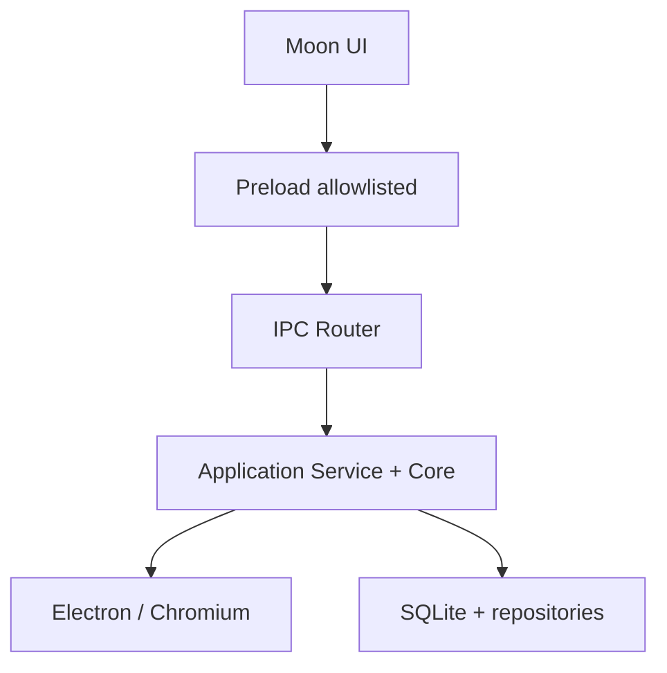

<div align="center">


# Moon Browser

### A web do seu jeito — mais ergonômica, contextual e humana.

O Moon é um navegador desktop open source da **Nexus Inc.**, construído sobre Electron e Chromium para unir navegação real, personalização profunda, produtividade e uma evolução responsável em direção a recursos nativos de inteligência artificial.

[](#moon-browser-05-demo)
[](https://github.com/heitgh/Moon-browser/actions/workflows/quality.yml)
[](https://www.electronjs.org/)
[](https://www.typescriptlang.org/)
[](LICENSE)
[](https://discord.gg/skB4s8KWW)

<br>


<sub>Substitua esta captura pelo arquivo <code>assets/moonpage.png</code>. O guia completo das imagens está na seção <a href="#capturas-do-projeto">Capturas do projeto</a>.</sub>

</div>

> [!IMPORTANT]
> **Moon Browser 0.5 Demo é uma versão pública de testes.** Ela já navega na web e possui recursos reais, mas ainda não deve ser tratada como um navegador estável para dados críticos ou como substituto definitivo do navegador principal. Relate falhas pelo [GitHub Issues](https://github.com/heitgh/Moon-browser/issues) ou pelo [Discord](https://discord.gg/skB4s8KWW).

## Sumário

- [Visão do projeto](#visão-do-projeto)
- [Moon Browser 0.5 Demo](#moon-browser-05-demo)
- [O que já funciona](#o-que-já-funciona)
- [Estado honesto das funcionalidades](#estado-honesto-das-funcionalidades)
- [Capturas do projeto](#capturas-do-projeto)
- [Arquitetura](#arquitetura)
- [Privacidade e segurança](#privacidade-e-segurança)
- [Roadmap](#roadmap)
- [Backlog estratégico](#backlog-estratégico)
- [Desenvolvimento](#desenvolvimento)
- [Testes e qualidade](#testes-e-qualidade)
- [Comunidade e equipe](#comunidade-e-equipe)

## Visão do projeto

O navegador tradicional organiza páginas. O Moon quer organizar **contextos, intenção e fluxo de trabalho**.

O projeto nasceu de uma pergunta simples:

> **E se o navegador se adaptasse ao usuário, em vez de obrigar o usuário a se adaptar ao navegador?**

Essa visão se apoia em quatro pilares:

1. **Ergonomia digital** — uma interface confortável para uso prolongado, com menos ruído, alvos legíveis e controle de movimento.
2. **Personalização real** — aparência, layout, Home, tipografia, busca, sidebar, workspaces, temas e wallpapers sob controle do usuário.
3. **Produtividade contextual** — abas, notas, histórico, downloads, sessões e ferramentas organizadas em torno do que a pessoa está fazendo.
4. **IA com consentimento** — inteligência integrada ao fluxo de navegação, sem acesso silencioso a páginas, histórico ou dados privados.

O objetivo não é apenas colocar um chatbot na lateral. A visão de longo prazo é criar uma camada inteligente entre usuário, web e ferramentas, capaz de auxiliar sem retirar autonomia.

## Moon Browser 0.5 Demo

`0.5.0-demo.1` representa a primeira demo pública da arquitetura reconstruída e testável do Moon no repositório oficial.

O desenvolvimento dessa base aconteceu em [`heitgh/Moon-tests-1`](https://github.com/heitgh/Moon-tests-1), usado como ambiente de experimentação. A versão consolidada foi transferida para este repositório preservando tanto o histórico do projeto original quanto o histórico técnico da reconstrução.

> [!NOTE]
> A antiga tag `v1.0.0` permanece como registro do protótipo inicial. A numeração `0.5 Demo` descreve com mais honestidade a maturidade do produto reconstruído; ela não apaga nem reescreve o histórico anterior.

### O que mudou em relação ao protótipo

| Protótipo inicial | Arquitetura 0.5 Demo |
| --- | --- |
| Interface concentrada em HTML/JS | Aplicação modular em TypeScript |
| Conteúdo web por estrutura legada | `WebContentsView` gerenciado no processo principal |
| Estado principalmente em `localStorage` | Perfil local, SQLite, migrations e repositories |
| Poucos testes automatizados | Unitários, integração, Electron e E2E |
| Configurações acopladas à tela | Settings V4 versionado, SQLite canônico, migração recuperável e preview |
| Recursos futuros misturados à interface | Feature flags e documentação de disponibilidade |
| Build manual e pouco verificável | CI, AppImage, pacote Debian e quality gates |

## O que já funciona

### Navegação e organização

- navegação HTTP/HTTPS e pesquisa com provedor configurável;
- múltiplas abas com voltar, avançar, recarregar, parar e abrir Home;
- workspaces com partições Electron separadas;
- restauração das abas não privadas ao reiniciar;
- favoritos, histórico, notas e atalhos locais;
- favicons validados, cacheados e exibidos em abas, Home, histórico e favoritos;
- downloads nativos com progresso, cancelamento e acesso ao arquivo;
- menu contextual nativo para página, link, seleção, campos editáveis, imagens e mídia.

### Ergonomia e personalização

- Home nativa e configurável;
- sidebar modular e recuperável por teclado;
- configurações em modal e como página interna `moon://settings/*`;
- modos Simples e Avançado, com “Ver tudo” explícito e pesquisa por intenção;
- personalização de aparência, layout, Home, tipografia, busca e workspace;
- preview ao vivo, aplicar, cancelar, desfazer, refazer e reset granular;
- largura e comportamento da sidebar, visibilidade dos workspaces e ordem da toolbar;
- temas salvos, wallpapers locais e importação opcional de wallpaper remoto com validações;
- design tokens para tipografia, espaçamento, contraste, foco, movimento e responsividade;
- suporte a preferência de movimento reduzido e diferentes tamanhos de viewport.

### Dados e confiabilidade

- SQLite no processo principal com WAL, foreign keys, migrations e transações;
- migração idempotente do perfil legado com backup da origem e rollback;
- exportação e importação de perfil em JSON versionado e validado;
- recuperação parcial de configurações corrompidas e `lastKnownGood`;
- modo seguro de configurações e diagnóstico sem incluir dados de navegação;
- sessões privadas efêmeras, excluídas da restauração persistente.

### Proteção e controle

- AdBlock real baseado em listas, com ativação controlada pelo usuário;
- `contextIsolation`, sandbox e Node.js desativado em páginas remotas;
- bridge preload congelada e limitada a canais permitidos;
- validação de protocolos, URLs, payloads e posse de abas por janela;
- prompts explícitos para permissões de sites;
- CSP local sem carregamento remoto automático de scripts;
- telemetria desativada por padrão;
- formato `.moontheme` V2 retrocompatível com V1, com hashes, assinatura Ed25519, quarentena, preview/thumbnail, Home, animação e rollback;
- bloqueio de traversal, arquivos executáveis, ZIP bombs, MIME falso e SVG ativo em pacotes de tema.

## Estado honesto das funcionalidades

O Moon diferencia recurso funcional, entrega parcial, preview e plano. Código de arquitetura ou uma tela demonstrativa, sozinhos, não significam que uma funcionalidade esteja pronta.

| Área | Estado na 0.5 Demo | Observação |
| --- | --- | --- |
| Home, navegação e abas | **Funcional** | Runtime desktop, editor direto, `.moonhome`, abas configuráveis e `Ctrl/Cmd+T` conectado ao Chromium |
| Workspaces | **Funcional** | Partições isoladas; evolução do estado continua |
| Favoritos, histórico e notas | **Funcional** | Ainda há migração gradual do estado do renderer para repositories |
| Downloads | **Funcional** | Eventos e progresso reais do Electron |
| AdBlock | **Funcional** | Serviço nativo conectado à interface |
| Settings V4 | **Funcional** | Modos Simples/Avançado, preview, commit SQLite, recuperação, importação e exportação |
| Temas e wallpapers | **Funcional / parcial** | Biblioteca unificada, regiões semânticas, paleta local e animação segura; favoritos/deduplicação avançada seguem no backlog |
| Moon Themes `.moontheme` | **Funcional localmente** | Conta, catálogo remoto e OAuth dependem do serviço externo |
| Perfis locais | **Funcional** | SQLite, shell, sessões, partições, downloads e preferências isolados; convidado temporário e migração do perfil Padrão cobertos por E2E |
| Engine de sync/E2EE | **Preparada / produção desativada** | Contratos e fixture local cobrem merge, tombstone, conflito, retry, recuperação e ausência de plaintext; não existe provider oficial |
| Cofre de credenciais | **Bloqueado com interface honesta** | Motor local e testes existem; esta build não possui backend seguro do SO, captura ou autofill |
| Permissões de sites | **Parcial** | Decisão explícita existe; persistência e revogação por origem serão ampliadas |
| Moon AI | **Preview desativado** | Não há provider de IA conectado; o painel não deve ser anunciado como IA operacional |
| Extensões Chromium | **Planejado / desativado** | Contratos existem, mas instalação segura ainda não está liberada |
| Plugins e marketplace | **Planejado / desativado** | SDK, sandbox e cadeia de confiança ainda serão concluídos |
| Universal Search | **Planejado** | Há fundação de busca; a experiência unificada ainda não está no shell |
| Smart Spaces e Timeline | **Planejado / desativado** | Estruturas internas não equivalem a produto conectado |
| VPN, sync em nuvem e auto-update | **Planejado / desativado** | Não existe provider oficial configurado; nenhuma sincronização remota é anunciada como ativa |
| Android e iOS | **Fundação arquitetural** | Existem contratos compartilhados, não aplicativos distribuíveis |

Para a matriz técnica completa, consulte [`docs/roadmap/status.md`](docs/roadmap/status.md).

## Capturas do projeto

As quatro imagens abaixo usam nomes fixos para facilitar futuras atualizações. Coloque os arquivos diretamente em `assets/`, em formato PNG, mantendo exatamente estes nomes.

| Arquivo | Conteúdo recomendado | Uso no README |
| --- | --- | --- |
| `assets/moonpage.png` | Home principal, limpa e em alta resolução | Imagem de capa |
| `assets/moon1.png` | Página web aberta, abas, toolbar e workspaces visíveis | Navegação real |
| `assets/moon2.png` | Central de personalização ou `moon://settings/appearance` | Personalização |
| `assets/moon3.png` | Sidebar, proteção, downloads, notas ou Moon Themes | Recursos do produto |

Recomendação: use capturas em proporção `16:9`, com pelo menos `1440 × 900`, sem dados pessoais, notificações, tokens ou páginas privadas.

| Navegação | Personalização |
| --- | --- |
|  |  |

| Sidebar e produtividade |
| --- |
|  |

<!--
GUIA PARA ATUALIZAR AS CAPTURAS
1. Salve a Home como assets/moonpage.png.
2. Salve a navegação como assets/moon1.png.
3. Salve as configurações como assets/moon2.png.
4. Salve a sidebar/proteção como assets/moon3.png.
5. Não altere os caminhos no README; basta substituir os arquivos.
-->

## Arquitetura

O Moon aplica inversão de dependência: a UI conhece contratos; o Core concentra regras de domínio; Electron, armazenamento, rede e segurança entram por adapters.



```text
main.js
  └─ apps/desktop/electron/main/main.ts
      ├─ BrowserApplicationService
      ├─ Core: tabs, state, events, sessions e workspaces
      ├─ BrowserManager + WebContentsView
      └─ ProfileStorage + better-sqlite3

preload.cjs
  └─ window.moonBrowser — bridge explícita e limitada

index.html
  └─ ui/browser-shell.ts — shell, Home, painéis e Settings V4
```

### Estrutura do repositório

```text
Moon-browser/
├─ apps/
│  ├─ desktop/            # runtime Electron, adapters, IPC e serviços
│  └─ mobile/             # contratos compartilhados; app ainda não distribuível
├─ packages/
│  ├─ core/               # domínio de abas, sessões, workspaces, estado e eventos
│  ├─ storage/            # SQLite, migrations, repositories e backup
│  ├─ security/           # AdBlock, isolamento, permissões e privacidade
│  ├─ navigation/         # navegação, busca e rotas internas
│  ├─ intelligence/       # contratos de IA; feature desativada na demo
│  ├─ context/            # fundação de contexto, Smart Spaces e Timeline
│  ├─ extensions/         # contratos de compatibilidade; instalação desativada
│  ├─ plugins/            # fundação do SDK e runtime; produto desativado
│  └─ theme-contract/     # contrato seguro de pacotes .moontheme
├─ ui/                    # shell, componentes, personalização e estilos
├─ database/              # schema, tabelas e seeds
├─ config/                # defaults, segurança e feature flags
├─ tests/                 # unitários, integração, Electron e E2E
├─ docs/                  # ADRs, arquitetura, segurança, auditorias e roadmap
├─ assets/                # marca, wallpapers e capturas
└─ scripts/               # build, desenvolvimento, banco e validação
```

Documentação de referência:

- [visão arquitetural](docs/architecture/overview.md);
- [arquitetura de segurança](docs/architecture/security.md);
- [modelo de ameaças](docs/security/threat-model.md);
- [decisões arquiteturais](docs/adr);
- [status da reconstrução](docs/roadmap/status.md);
- [configuração do ambiente](docs/development/setup.md).

## Privacidade e segurança

O conteúdo da web é sempre tratado como não confiável. Uma página remota não recebe Node.js, preload do Moon, acesso ao banco ou APIs internas.

Princípios obrigatórios:

- contexto somente quando necessário e permitido;
- nenhuma página, aba, nota ou histórico enviado a IA sem consentimento granular;
- sessões privadas não persistem no perfil restaurável;
- ações destrutivas, externas ou sensíveis exigem confirmação;
- extensões e plugins permanecem desligados até terem sandbox, permissões e revogação verificáveis;
- atualizações automáticas permanecem desligadas até existir assinatura e distribuição confiável;
- recursos de segurança não são anunciados antes de estarem conectados e testados.

Falhas de segurança não devem ser publicadas com dados sensíveis em issues abertas. Entre em contato por [`nexusinkmoon@gmail.com`](mailto:nexusinkmoon@gmail.com) com uma descrição mínima e reproduzível.

## Roadmap

O roadmap é orientativo e pode mudar conforme testes, segurança, desempenho e feedback da comunidade.

| Marco | Objetivo | Entregas principais |
| --- | --- | --- |
| **0.5 Demo — agora** | Fundação pública verificável | Navegação, abas, workspaces, Settings V4, SQLite, sessões, AdBlock, downloads, temas, Moon Themes, CI e builds Linux |
| **0.6 — Ergonomia e produtividade** | Tornar o uso diário mais fluido | Home Fase B, presets realmente distintos, biblioteca de wallpapers, sidebar evoluída, pesquisa de configurações e início da Universal Search |
| **0.7 — Moon Intelligence** | IA útil com controle humano | Providers opcionais, permissões de contexto, resumo, explicação, tradução, tarefas, flashcards e comparação entre páginas |
| **0.8 — Contextual Browser** | Organizar atividades, não apenas URLs | Smart Sessions, Smart Spaces sugeridos, Navigation Timeline e Command Center |
| **0.9 — Moon Platform** | Abrir o ecossistema com segurança | Compatibilidade progressiva com extensões, Plugin API, widgets, automações, marketplace e sync preparado para múltiplos dispositivos |
| **1.0 — Stable** | Navegador auditado e distribuível | Releases assinadas, auto-update seguro, acessibilidade validada, budgets de desempenho e suporte desktop consolidado |

### Critérios antes da 1.0

- permissões persistentes e revogáveis por origem;
- todos os canais IPC com schemas compartilhados, limites e testes de origem;
- pipeline único para AdBlock e futuras políticas de rede;
- migração completa do estado duplicado do renderer para Application/repositories;
- builds reproduzíveis, assinados e testados em Linux, Windows e macOS;
- revisão independente de segurança e privacidade;
- documentação de recuperação, backup e compatibilidade.

## Backlog estratégico

As ideias abaixo foram consolidadas a partir do arquivo de planejamento do projeto. Elas representam direção de produto, não promessa de disponibilidade imediata.

### Prioridades de maior impacto

| Ideia | Prioridade | Resultado esperado |
| --- | ---: | --- |
| Moon AI na sidebar | **10/10** | Perguntas e ações sobre a página com consentimento |
| Smart Sessions | **9/10** | Retomar abas, contexto, grupos e notas de uma atividade |
| Universal Search | **9/10** | Buscar web, abas, histórico, favoritos, notas, downloads, temas, configurações e comandos |
| Smart Spaces | **8/10** | Sugerir agrupamentos como Estudos, Desenvolvimento e Trabalho |
| Navigation Timeline | **8/10** | Retomar visualmente o que estava sendo feito em determinado horário |
| Extension e Plugin API | **8/10** | Permitir módulos comunitários com capabilities explícitas |
| Smart Home | **7/10** | Widgets de tarefas, agenda, foco, páginas frequentes e leitura em andamento |
| Adaptive UI | **7/10** | Extrair uma paleta segura do wallpaper e adaptar acentos e contraste |

### Moon AI e contexto

- resumir páginas e documentações;
- explicar textos difíceis ou erros de programação;
- traduzir mantendo o contexto;
- extrair tarefas e gerar planos de ação;
- criar flashcards e planos de estudo;
- comparar páginas, produtos ou preços entre abas;
- responder perguntas com base apenas nas fontes autorizadas;
- memória de sessão opcional, transparente e apagável.

### Sidebar e Home

- tarefas, calendário e leitura posterior;
- histórico de clipboard com controles de privacidade;
- snippets de código e notas vinculadas à página;
- últimas abas, páginas frequentes, metas do dia e tempo de foco;
- widgets reordenáveis por drag-and-drop e teclado;
- presets de Home para estudo, trabalho, desenvolvimento e modo minimalista.

### Moon Study

- bloqueio de distrações e Pomodoro;
- captura de trechos com referência à fonte;
- notas e resumos ligados à página;
- flashcards e exportação para Markdown;
- integração opcional com ferramentas como Obsidian.

### Moon Dev

- visualizador de JSON e inspetor de APIs;
- editor Markdown e biblioteca de snippets;
- DevTools melhor integradas ao workspace;
- terminal local com permissões claras;
- suporte a SSH somente em uma fase futura e após revisão de segurança.

### Plataforma comunitária

Uma futura Plugin API poderá permitir painéis, widgets e automações isolados:

```ts
moon.registerPanel({
  id: "pomodoro",
  title: "Pomodoro",
  capabilities: ["storage"],
  render(container) {
    // Módulo executado apenas após validação e consentimento.
  }
});
```

Esse contrato é apenas uma ilustração de direção; a API pública ainda não está liberada.

## Desenvolvimento

### Requisitos

- Node.js 22 ou superior;
- npm 10 ou superior;
- Git e Python;
- toolchain C/C++ exigida pelo `better-sqlite3`;
- Linux, Windows ou macOS para desenvolvimento desktop.

### Instalação

```bash
git clone https://github.com/heitgh/Moon-browser.git
cd Moon-browser
npm ci
npm run dev:desktop
```

Para iniciar a aplicação após compilar:

```bash
npm start
```

Copie `.env.example` para `.env` somente quando necessário e nunca versione chaves ou tokens.

### Build desktop

```bash
npm run build:desktop
```

Os artefatos são gravados em `release/`. Na validação atual, o build Linux gera:

- `Moon-Browser-0.5.0-demo.1-linux-x86_64.AppImage`;
- `Moon-Browser-0.5.0-demo.1-linux-amd64.deb`.

Windows e macOS possuem alvos declarados, mas só devem receber releases públicos depois de validação e assinatura próprias.

## Testes e qualidade

```bash
npm run typecheck
npm run lint
npm run test:unit
npm run test:integration
npm run native:electron
npm run test:electron-storage
npm run test:e2e
npm audit --audit-level=high
npm run build:desktop
```

| Camada | Cobertura atual |
| --- | ---: |
| Testes unitários | 52 testes |
| Integração do shell | 17 testes |
| SQLite e serviços no Electron | 6 testes |
| E2E Electron | 5 fluxos |

Em Linux sem sessão gráfica, execute o E2E com:

```bash
xvfb-run -a npm run test:e2e
```

O workflow [`quality.yml`](.github/workflows/quality.yml) repete os gates em cada push para `main` e em pull requests. O repositório também utiliza CodeQL e Dependabot; o dependency review poderá ser ativado quando o Dependency graph estiver habilitado nas configurações do repositório.

## Contribuindo

1. Consulte o [status atual](docs/roadmap/status.md) para não duplicar trabalho ou ativar contratos incompletos.
2. Abra uma issue descrevendo problema, motivação e resultado esperado.
3. Crie uma branch pequena e focada.
4. Preserve os invariantes de segurança e a compatibilidade do perfil.
5. Adicione ou atualize testes.
6. Execute os quality gates relevantes.
7. Documente mudanças de comportamento e limitações.

Leia também [`docs/development/contributing.md`](docs/development/contributing.md).

## Comunidade e equipe

O Moon Browser faz parte do ecossistema brasileiro **Nexus Inc.**, voltado a tecnologia, educação e inovação acessíveis, com produtos construídos a partir das necessidades reais dos usuários.

Equipe principal e colaboradores do ecossistema:

- Ariel Apolinario;
- João Pedro Melo;
- Jonathan Santos;
- Julio Prates;
- Luan Gonçalves;
- Thiago Barbosa.

### Contato

- **Discord:** [discord.gg/skB4s8KWW](https://discord.gg/skB4s8KWW)
- **E-mail:** [nexusinkmoon@gmail.com](mailto:nexusinkmoon@gmail.com)
- **Issues:** [github.com/heitgh/Moon-browser/issues](https://github.com/heitgh/Moon-browser/issues)

## Licença

Distribuído sob a [Licença MIT](LICENSE). Você pode estudar, usar, modificar e redistribuir o projeto conforme os termos da licença.

---

<div align="center">

**Moon Browser**

*Made for users. Built with users.*

**Nexus Inc. · 2026**

</div>
