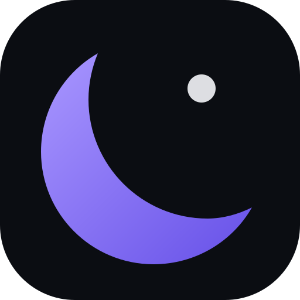
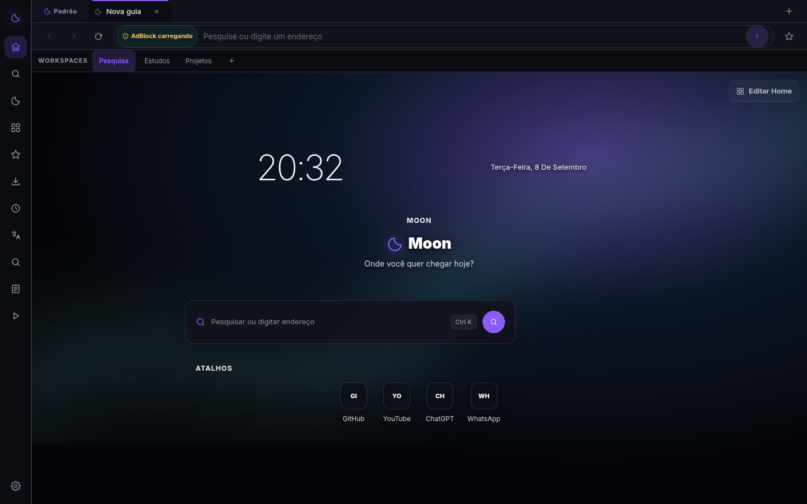
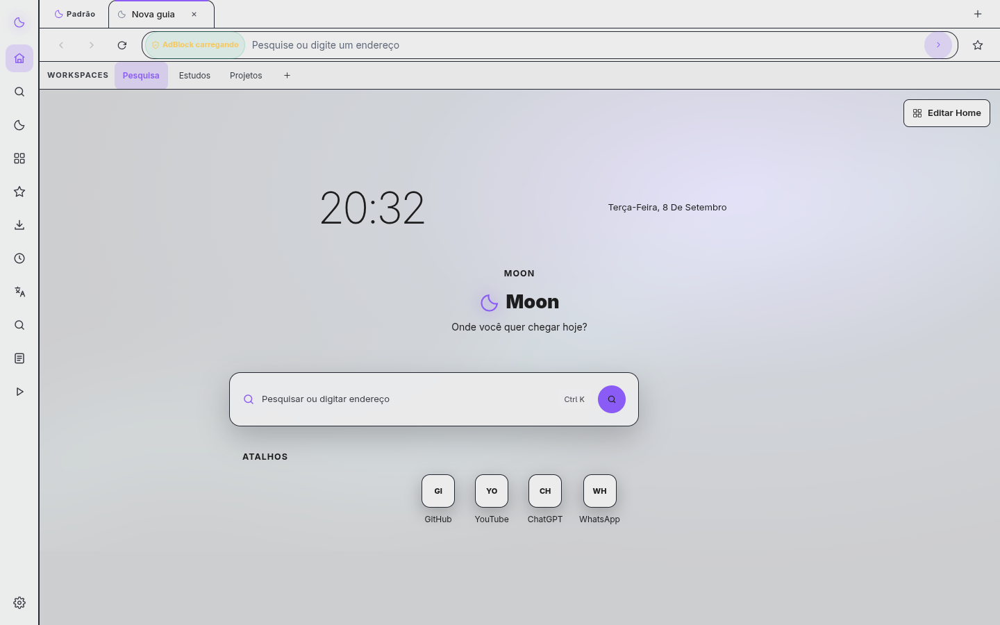
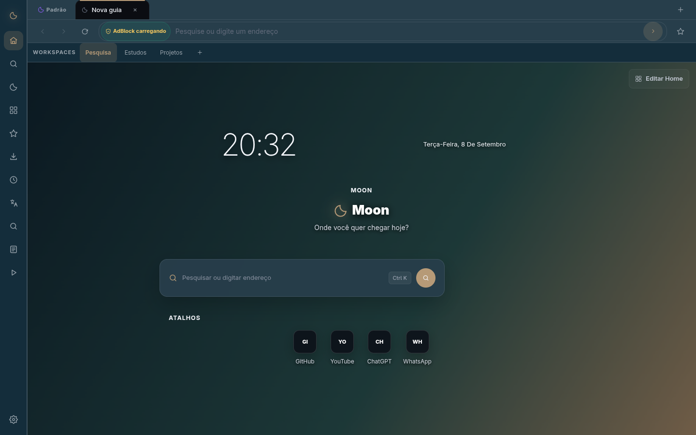
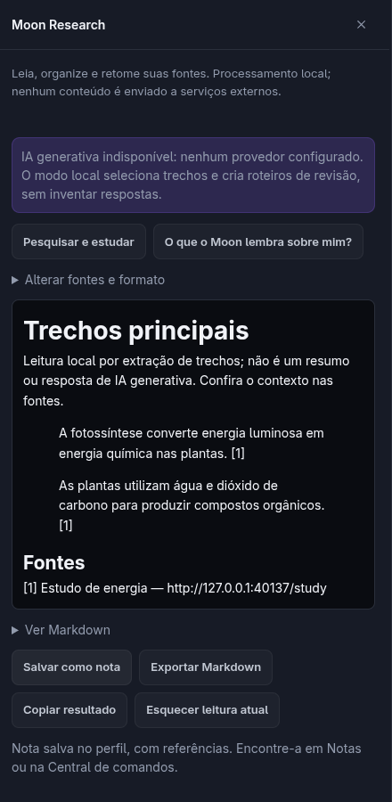
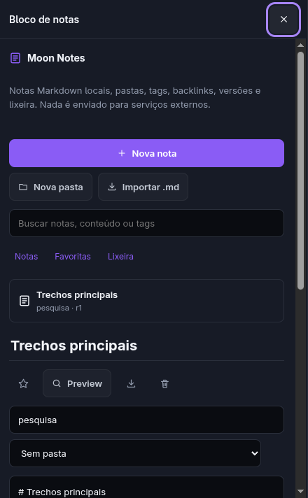

<div align="center">
  

# Moon Browser

### A browser that adapts to the way you work.

**Open-source desktop browser focused on deep customization, workspaces, local research tools and explicit user control.**

[](https://github.com/heitgh/Moon-browser/actions/workflows/quality.yml)
[](LICENSE)
[](https://github.com/heitgh/Moon-browser/releases/tag/v0.6.0-alpha.7)
[](CHANGELOG.md)

[**Download**](#download) · [**Website**](https://moon-browser.vercel.app) · [**See the product**](#o-que-o-moon-propoe) · [**Contribute**](CONTRIBUTING.md) · [**Report a bug**](https://github.com/heitgh/Moon-browser/issues)

</div>



> [!IMPORTANT]
> O Moon é experimental. A última pré-release pública é `v0.6.0-alpha.7`; o código `alpha.8` ainda não foi publicado. Não use o Moon como único navegador para dados críticos.

A `alpha.7` tem atualização nativa no Windows instalado e no AppImage, mas foi lançada antes do novo gate de assinatura. Quando a `alpha.8` assinada for publicada, a migração inicial deverá usar o instalador da [página oficial](https://github.com/heitgh/Moon-browser/releases); depois disso, o atualizador usará um feed separado com verificação de assinatura. O Chromium acompanha o pacote Moon. Consulte a [política de release](docs/security/release-policy.md) e o [histórico](CHANGELOG.md).

## O que é o Moon?

O Moon é um navegador desktop open source construído sobre **Electron + Chromium**. O projeto explora uma ideia simples:

> **E se o navegador se adaptasse ao usuário, em vez de obrigar o usuário a se adaptar ao navegador?**

A proposta não é esconder a complexidade atrás de promessas de “IA mágica”. O foco atual é tornar navegação, organização, pesquisa e personalização mais controláveis por quem usa o computador todos os dias.

### O que o Moon propõe

| Pilar | Como aparece no produto |
| --- | --- |
| **Personalização profunda** | Home, layout, temas, ícones, wallpapers e posição das abas podem ser adaptados ao usuário. |
| **Organização por contexto** | Workspaces, favoritos, histórico, notas e sessões ajudam a separar assuntos e retomar trabalho. |
| **Research local** | A alpha consegue ler abas selecionadas, extrair trechos e salvar material com referência à fonte. |
| **Memória sob controle** | O usuário escolhe manualmente o que guardar, por categoria e workspace. Nada é capturado automaticamente só porque a categoria foi habilitada. |
| **Transparência** | Recursos experimentais, limitações, arquitetura e decisões de segurança são documentados no repositório. |

## Veja em ação

### Personalização e Home

<p align="center">
  
  
</p>

### Research e notas

<p align="center">
  
  
</p>

As capturas acima vêm da alpha e usam dados de teste. Elas mostram cenários reais do projeto, mas não garantem o mesmo comportamento em toda plataforma ou máquina.

<a id="download"></a>
## Download

### Prerelease pública — `v0.6.0-alpha.7`

| Sistema | Download | Integridade |
| --- | --- | --- |
| **Windows x64** | [Instalador `.exe`](https://github.com/heitgh/Moon-browser/releases/download/v0.6.0-alpha.7/Moon-Browser-0.6.0-alpha.7-Windows-x64-Setup.exe) · [Portátil `.exe`](https://github.com/heitgh/Moon-browser/releases/download/v0.6.0-alpha.7/Moon-Browser-0.6.0-alpha.7-Windows-x64-Portable.exe) | [SHA-256](https://github.com/heitgh/Moon-browser/releases/download/v0.6.0-alpha.7/SHA256SUMS-windows.txt) |
| **Linux x64** | [AppImage](https://github.com/heitgh/Moon-browser/releases/download/v0.6.0-alpha.7/Moon-Browser-0.6.0-alpha.7-Linux-x64.AppImage) · [DEB](https://github.com/heitgh/Moon-browser/releases/download/v0.6.0-alpha.7/Moon-Browser-0.6.0-alpha.7-Linux-x64.deb) · [RPM](https://github.com/heitgh/Moon-browser/releases/download/v0.6.0-alpha.7/Moon-Browser-0.6.0-alpha.7-Linux-x64.rpm) · [pacman](https://github.com/heitgh/Moon-browser/releases/download/v0.6.0-alpha.7/Moon-Browser-0.6.0-alpha.7-Linux-x64.pacman) | [SHA-256](https://github.com/heitgh/Moon-browser/releases/download/v0.6.0-alpha.7/SHA256SUMS-linux.txt) |

[**Ver todas as releases →**](https://github.com/heitgh/Moon-browser/releases)

Para AppImage:

```bash
chmod +x Moon-Browser-0.6.0-alpha.7-Linux-x64.AppImage
./Moon-Browser-0.6.0-alpha.7-Linux-x64.AppImage
```

> A `v0.6.0-alpha.7` é uma prerelease pública. Windows e Linux possuem instaladores oficiais e checksums; esta versão não oferece o novo gate de assinatura da `alpha.8`. macOS ainda não possui build publicado.

O código da `0.6.0-alpha.8` está em desenvolvimento. A [auditoria atual](docs/audits/moon-browser-2026-11-23.md) e a [política de release](docs/security/release-policy.md) distinguem as proteções já testadas dos gates que ainda precisam de chaves e máquinas de homologação. Não há instalador alpha.8 publicado.

Em uma janela normal, o botão de download na barra de abas abre o estado das atualizações e permite consultar manualmente o GitHub. Quando uma nova versão do canal for publicada, o botão recebe um indicador e oferece download; builds sem assinatura própria abrem a página oficial. A consulta automática pode ser desligada no painel de atualização, mas a verificação manual continua disponível. Em janelas anônimas ou de convidado, o botão oferece apenas a página oficial. Sem release mais recente publicada, nenhum instalador novo pode ser oferecido.

## Estado do projeto

### Etapa 1 em revisão — encerramento e recuperação

O código em desenvolvimento inclui espera de gravações, checkpoint SQLite e recuperação isolada do perfil. Backups SQLite não incluem cookies nem partições Chromium; a exportação bruta não é criptografada. Consulte [escopo, testes e limitações](docs/review/stage1-shutdown-recovery.md). O encerramento ainda exige homologação prolongada em cada plataforma.

| Área | Estado atual |
| --- | --- |
| Navegação, abas e janelas | **Disponível / em evolução** |
| Workspaces, favoritos e histórico | **Disponível** |
| Home e personalização | **Disponível** |
| Notas locais | **Disponível** |
| Central de comandos e Foco/Zen | **Disponível** |
| Research local | **Experimental na alpha** |
| Memory e sessões nomeadas | **Experimental na alpha** |
| Extensões / plugins | **Fundação técnica; não liberado** |
| Sync e cofre | **Fundação técnica; produção bloqueada** |
| IA generativa | **Não disponível** |
| Extração de PDF | **Não disponível** |
| Atualizador automático assinado | **Código preparado na alpha.8; release assinada não publicada** |
| macOS / ARM / mobile | **Não homologados** |

Para a matriz detalhada de implementação e validação, consulte [`docs/update/RELATORIO.md`](docs/update/RELATORIO.md) e [`docs/update/ARQUITETURA.md`](docs/update/ARQUITETURA.md).
Veja também [requisições automáticas de rede](docs/security/network-requests.md), [compatibilidade](docs/roadmap/compatibility.md) e [capacidades reais](docs/product/capabilities.md).

## Privacidade e controle

Na versão em desenvolvimento, abra **Configurações → Privacidade e dados** para revisar rastreadores, cookies HTTP, exceções e permissões por site. Leia o [guia da central de privacidade](docs/review/stage5-privacy.md) para entender o escopo e a limpeza.

O Moon tenta tornar explícito quando uma ferramenta lê ou guarda informação.

- Research trabalha somente com abas selecionadas no fluxo atual.
- A memória começa **desligada** por categoria e exige gravação manual.
- Preferências, workspaces, histórico, notas e memória ficam no armazenamento local do perfil.
- O Research atual **não usa IA generativa** nem envia conteúdo para um modelo externo.
- Janelas privadas usam partições efêmeras e não expõem Research/Memory.
- A memória não possui criptografia própria em repouso; a proteção local depende também do sistema operacional.

Esses mecanismos reduzem riscos, mas **não tornam o Moon anônimo, invulnerável ou mais privado que todos os concorrentes**. Consulte a documentação de segurança antes de usar dados sensíveis.

[**Security policy →**](SECURITY.md) · [**Threat model →**](docs/architecture/threat-model-final-update.md)

## Arquitetura em 30 segundos

```text
Interface local
  → preload com operações permitidas
  → IPC validado no processo principal
  → serviços da aplicação
      ├─ SQLite do perfil
      └─ páginas em WebContentsView isolado
```

**Stack principal:** TypeScript · Electron · Chromium · Node.js · SQLite · Playwright · Vitest · GitHub Actions

As páginas remotas não recebem acesso direto ao Node.js nem ao preload interno do Moon. Detalhes e decisões arquiteturais estão em [`docs/architecture`](docs/architecture/) e [`docs/adr`](docs/adr/).

## Rodando a alpha a partir do código

### Requisitos

- Node.js **22+**
- npm **10+**
- Git
- Python e toolchain C/C++ para módulos nativos
- bibliotecas gráficas exigidas pelo Electron no sistema

```bash
git clone https://github.com/heitgh/Moon-browser.git
cd Moon-browser
npm ci
npm run native:electron
npm run dev:desktop
```

### Qualidade

```bash
npm run typecheck
npm run lint
npm run test:unit
npm run test:integration
npm run native:electron
npm run test:electron-storage
npm run test:e2e
```

O CI da `main` executa as verificações documentadas no workflow [`quality.yml`](.github/workflows/quality.yml).

## Roadmap

O Moon não promete datas para funcionalidades futuras. A prioridade atual é consolidar a experiência desktop antes de ampliar o escopo.

### Agora

- compatibilidade e estabilidade do desktop;
- instalação, atualização e recuperação;
- acessibilidade e desempenho;
- amadurecimento de Research/Memory;
- validação com usuários externos.

### Depois

- PDF e busca mais inteligente;
- sessões mais completas;
- infraestrutura real de sync/cofre;
- avaliação responsável de IA integrada;
- extensões e plugins com modelo de segurança definido;
- expansão de plataforma somente após validação.

Veja o histórico e decisões em [`CHANGELOG.md`](CHANGELOG.md), [`docs/roadmap`](docs/roadmap/) e [`docs/adr`](docs/adr/).

## Contribua

Contribuições úteis não precisam começar com uma grande feature. Bons primeiros passos incluem:

- reproduzir e documentar bugs;
- melhorar acessibilidade;
- testar em distribuições Linux e versões do Windows;
- melhorar documentação;
- adicionar testes para comportamentos já existentes;
- propor melhorias de UX partindo de um problema concreto.

Leia [`CONTRIBUTING.md`](CONTRIBUTING.md) antes de abrir um PR.

[**Abrir bug**](https://github.com/heitgh/Moon-browser/issues/new/choose) · [**Ver issues**](https://github.com/heitgh/Moon-browser/issues) · [**Guia de suporte**](SUPPORT.md) · [**Código de conduta**](CODE_OF_CONDUCT.md)

## Para quem quer divulgar ou escrever sobre o projeto

Criamos um pequeno [`Media Kit`](docs/MEDIA_KIT.md) com descrição oficial, estado atual, diferenciais, stack, links e termos recomendados. Ele existe para manter posts, vídeos e matérias alinhados ao que o Moon realmente entrega hoje.

## Equipe

O Moon é desenvolvido pela **Nexus Inc.** com participação em desenvolvimento, testes, documentação, produto e marketing.

- **Julio L. Prates** — criação, desenvolvimento e direção do projeto.
- **Ariel Apolinario** — testes, bugs, ideias e marketing.
- **Luan Gonçalves** — testes, bugs, ideias e marketing.
- **João Pedro Siqueira Melo** — desenvolvimento e funcionalidades.
- **Jonathan Santos** — apoio, gestão e coordenação de testes.

## Licença

Moon Browser é distribuído sob a [licença MIT](LICENSE). Electron, Chromium e demais dependências mantêm suas próprias licenças e marcas.

---

<div align="center">

### Built for people who live on their computers.

**Explore. Organize. Customize. Keep control.**

[Website](https://moon-browser.vercel.app) · [Releases](https://github.com/heitgh/Moon-browser/releases) · [Issues](https://github.com/heitgh/Moon-browser/issues) · [Media Kit](docs/MEDIA_KIT.md)

</div>

### Proteção de acesso integrada (PR #39, ainda não publicada)

Em **Gerenciar perfis → Segurança do perfil**, a próxima atualização permite ativar senha, alterá-la/removê-la com a senha atual, bloquear agora e configurar inatividade. O bloqueio pela tela do sistema é específico de Windows/macOS. A janela isolada exige senha antes de carregar o perfil; a proteção também é aplicada no processo principal ao IPC.

A senha impede acesso casual pelo aplicativo, mas **não criptografa os arquivos**. Não há recuperação de senha nesta implementação: o aviso nativo precisa ser confirmado ao ativar. Quem controla a conta e os arquivos do sistema pode remover essa proteção. Consulte os [passos de teste e limites](docs/review/stage2-profile-access.md). A matriz de testes e builds Windows/Linux passou no PR #39; os downloads públicos permanecem na versão publicada.

### Recursos em revisão (ainda não publicados)

**Menu Moon → Recursos** ou **Ctrl/Cmd+Shift+E** abre RAM, CPU, processos únicos e páginas pesadas. A opção do próprio painel adiciona o botão à sidebar. O consumo por aba corresponde ao processo inteiro, que pode ser compartilhado; amostras indisponíveis ou parciais são identificadas. Em Economizar, declare os sites seguros para recarga e avalie quais abas estáticas podem ser suspensas. A automação começa desativada. Consulte o [medidor de recursos](docs/review/stage3-resource-monitor.md) e a [política de suspensão](docs/review/stage4-resource-economy.md).
